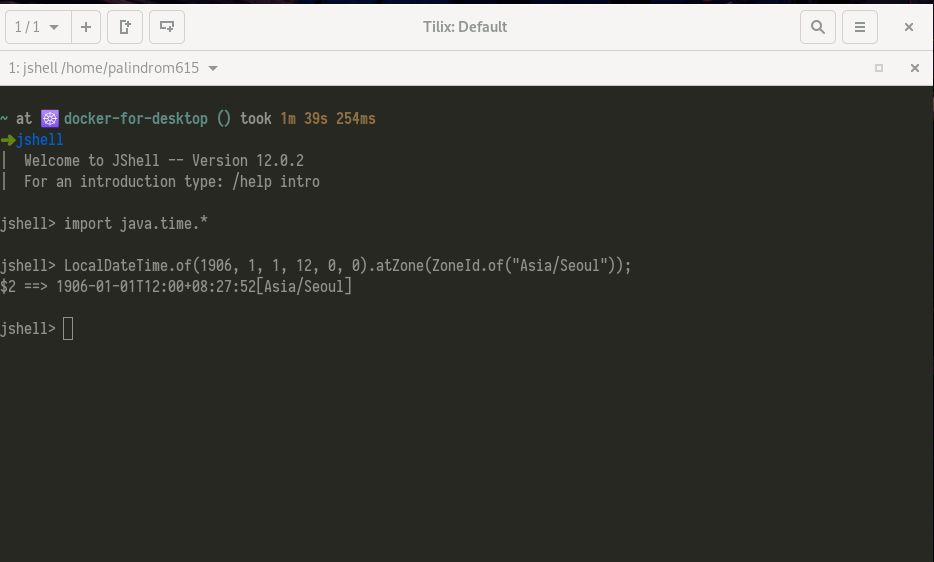

## 오늘의 경험

자세히 어떤 것을 만들고 있었는지는 회사 내부에서 일어난 일이기 때문에 말하기 꺼려지지만, 어떤 사람의 생일을 포함한 인적 정보를 웹 인터페이스로 갱신하는 프로그램을 만들고 있었다. 이 서비스에서는 생일을 포함한 모든 날짜를 DB에 mysql datetime 자료형으로 저장하고 있다. 특별히 날짜와 시간을 구분해야 하는 이유가 없다면 많이들 그냥 그렇게 하리라고 생각한다.

생일을 업데이트한 뒤 다시 프론트엔드에서 불러오는 과정에서 자꾸 에러가 났다. 확인해 보니 생일이 이상한 포맷으로 전달되는 것을 발견. 

`1906-01-01T12:00:00+08:27:52`

시간 표기에 관한 국제 표준인 [ISO 8601](https://ko.wikipedia.org/wiki/ISO_8601)의 타임존 부분에 초 단위가 들어가서 자바스크립트 날짜 라이브러리인 [moment.js](https://momentjs.com/)가 파싱을 못하고 Invalid Date를 뱉고 있는 것이었다. 덧붙여, ISO 8601은 UTC 기준 표기만을 지원하기 때문에 타임존에 초 단위를 넣는 것은 ISO-8601 정식 표준이 아니다. 그러니까, 저 포맷은 ISO 8601을 만족시키지 못한다.

알고 보니 한국에서 그리니치 표준시가 도입된 것은 1907년 4월 1일. 그 전까지 한국 표준시간대는 그리니치 기준 +08:27:52. 그리고 자바 [ZonedDateTime](https://docs.oracle.com/javase/8/docs/api/java/time/ZonedDateTime.html)은 이 역사적 사실을 충실히 구현했다: 

결국 ISO 8601에 맞도록 문자열을 직접 조작하는 방식으로 디버깅을 하긴 했지만 moment.js에 [이슈 리포팅](https://github.com/moment/moment-timezone/issues/772)은 넣었다. 표준이 아니라고 해서 정상적인 표기가 아닌 것은 아니니까! 타임머신을 타고 돌아간다면 그때는 지금 사용하는 시간대인 UTC +09:00보다 32분 8초 늦게 가는 시계를 사용하고 있을 것이니, 엄연히 그 당시 한국 표준 시각에 맞춘 역사적으로는 가장 올바른 표기다. moment.js 정도 되는 라이브러리가 GMT가 사용되기 이전(불과 200년도 안됐다)의 시간을 제대로 표기할 방법이 없다면 이상하지 않은가?
