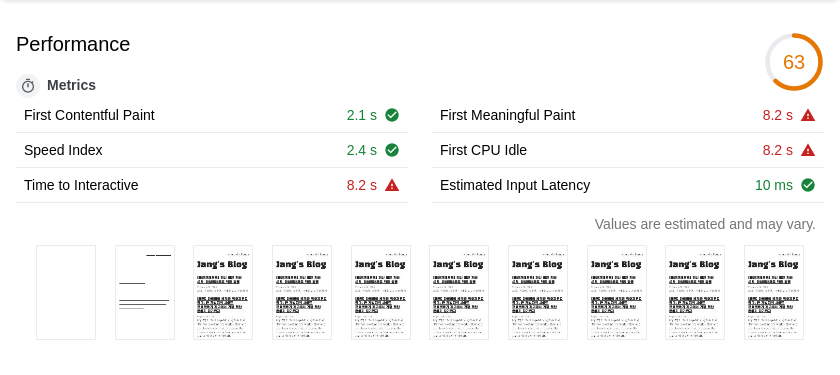
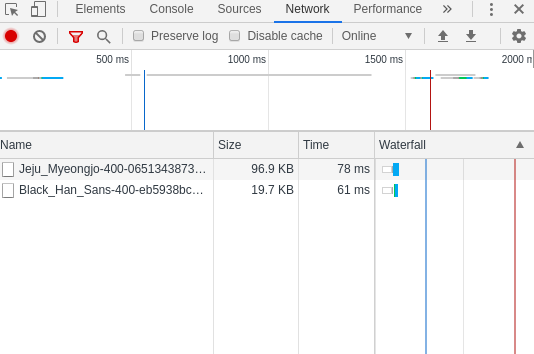
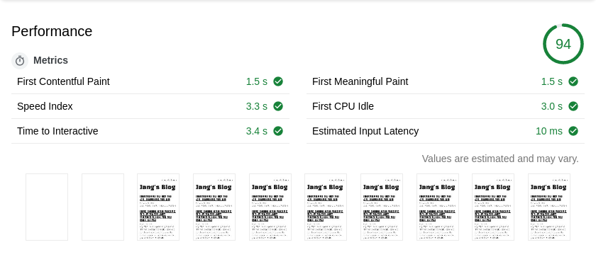

지금 보는 내 블로그에서는 본문에 [제주 명조](https://www.jeju.go.kr/jeju/symbol/font/myeongjo.htm), 제목에 [검은 고딕](https://github.com/zesstype/Black-Han-Sans) 글꼴을 사용한다.


최적화하기 전 내 블로그 웹 폰트 로딩 시간이다. 보다시피 1.1MB짜리 제주 명조를 다운받는데 861ms를 썼다. 내 블로그에 들어가면 글꼴이 제대로 뜰 때까지 1초 가까이 손가락 빨면서 기다려야 하는 것이다.

1.1MB는 내 블로그에 낭비하기에 너무 큰 트래픽이다. 같은 트래픽으로 고품질 이미지 섬네일 열댓 개를 띄울 수 있다. 또는 인스타그램 동영상 미리 보기 세 개를 볼 수 있다.

몇 달을 방치해두다가 라이트하우스 점수가 너무 안 나와서 최적화하기로 했다.

[`subfont`](https://github.com/munter/subfont)로 블로그에서 사용되는 글자들만 추출해 내서 블로그에서 사용하는 폰트의 파일 크기를 크게 줄인 경험을 공유한다.

## 한글 웹 폰트 기초 상식

한중일(CJK)은 글자 수가 알파벳보다 훨씬 많다 보니 글꼴 파일도 훨씬 크다. 예를 들어, 키릴 문자와 유럽 문자까지 지원하는 무료 글꼴인 [Merriweather](https://fonts.adobe.com/fonts/merriweather#fonts-section)는 otf 크기가 고작 112KB인데, 한글 자모 조합 11172자를 모두 지원하는 폰트중 가장 가볍다는 [이롭게 바탕체](http://font.iropke.com/batang)는 otf 기준 1.6MB다. 10배 이상 차이 난다. 흑흑.

그래서 여러 가지 최적화를 하는데, 기껏 만들어준 디자이너님께 미안하지만 필요한 글자들만 남기고 나머지 글리프를 다 깎아내 서브셋 폰트(subset font)를 만들어 쓰는 방식이 자주 쓰인다. 대체로 자주 쓰이는 한글 2350자(일명 완성형 한글)를 갖고 서브셋을 만든다. [스포카 한 산스](https://spoqa.github.io/spoqa-han-sans/ko-KR/)처럼 아예 글꼴을 만들 때 2350자만 넣는 케이스도 있다.

다른 기법이랑 기술적인 얘기는 아래 링크를 보는 게 좋겠다.

- [Google Web Fundamental reference](https://developers.google.com/web/fundamentals/performance/optimizing-content-efficiency/webfont-optimization?hl=ko)
- [네이버 D2 기술 블로그](https://d2.naver.com/helloworld/4969726)

## Google Fonts

[로컬 스토리지 캐싱](https://mytory.net/2016/06/15/webfont-best-practice.html)이라던지 여러 가지 로컬 캐싱 기법은 리텐션이 없다시피 한 개인 블로그에는 맞지 않는다.

일반적으로 개인 블로그에서 웹 폰트를 최적화하는 가장 좋은 방법은 그냥 **Google Fonts만 사용하는 것**이다. 다시 내 블로그의 폰트 로딩 그래프를 보자.


통짜 폰트 파일을 넘겨받는 제주 명조와는 달리 Google Fonts를 사용한 검은 고딕을 다운받을 때는 13KB 내외의 여러 파일로 나뉘어서 온다. 구글 폰트에서 아주 어그레시브하게 쓰는 방법인데, CSS에 [unicode-range](https://developer.mozilla.org/en-US/docs/Web/CSS/@font-face/unicode-range)라는 명세가 있다. 쉽게 말해 폰트 파일을 몇 글자씩 쪼개 놓으면 브라우저가 알아서 필요한 파일만 다운받아 가는 기능이다.

[Google Fonts + 한국어](https://googlefonts.github.io/korean/)에 따르면

> Google Fonts는 머신 러닝에 기반을 둔 최적화 기술을 통해 한글 폰트를 동적으로 분할 다운로드합니다. <br /><br />웹상의 방대한 한국어 문서를 분석한 결과, Google은 주제에 따라 사용되는 글자의 패턴을 발견하고, 패턴에 따라 한글 폰트에 포함된 17,388개의 글리프를 100여 가지 그룹으로 나누었습니다. 여기에 Google Fonts는 사용자가 웹 페이지를 불러올 때, 폰트 전체를 다운로드 하는 대신 내용을 표시하는 데 꼭 필요한 몇 가지 그룹만을 선택적으로 다운로드 하는 방식으로 폰트를 제공합니다. 이 기술을 적용한 Google Font를 사용하면 보다 빠르게 폰트 전체를 다운로드한 것과 다름없는 페이지를 제공할 수 있습니다. <br /><br />또한 Google Fonts API의 사이트 간 캐싱(cross-site caching)을 통해 해당 폰트가 여러 웹사이트에서 사용될수록 전체 다운로드 시간은 줄어들고, 한글 웹 폰트를 둘러싼 사용자 경험은 그만큼 개선될 것입니다.

**머신 러닝**으로 필요한 글자들만 족집게처럼 알아맞혀서 서브셋된 폰트를 서빙해준다는 것이다. 알파벳만 쓰는 외국인들은 폰트를 셀프 호스팅하는 게 Google Fonts보다 훨씬 빠르다느니 배부른 소리를 하지만[^1] 한글 폰트에는 이게 최고다. 그냥 최적화니 뭐니 아무것도 안하고 구글 폰트만 써도 어디 가서 폰트 때문에 느리다는 소리 절대 듣지 않는다.

[^1]: https://www.bricolage.io/typefaces-easiest-way-to-self-host-fonts/

## 제주 명조

인쇄 매체에는 세리프가 있는 명조나 바탕체 계열이 가독성이 높고, 해상도가 낮은 웹이나 데스크탑 환경에서는 산세리프, 고딕, 돋움체 계열이 가독성이 높다는 것이 상식이다. 그러나 이제 모바일에서 레티나 환경이 보편화하면서 웹 사이트에도 세리프 계열 폰트를 쓰는 곳이 늘고 있다.

구글 폰트에는 한글 본문용 세리프 글꼴이 정말 적다. 나눔 명조 정도가 고작인데, 내가 쓰는 오래된 모니터에서 잘 안보여서 피했다. 그리고 개인 사이트에 지나치게 회사 색이 드러나는 글꼴은 피하고 싶어서 이런저런 다른 글꼴도 못 쓰겠고, 제주도 같은 데로 뜨고 싶다는 강한 염원(?)을 담아 본문에 제주 명조를 사용한다.

아쉽게도 내가 쓰려는 제주 명조는 아직 [구글 폰트 얼리 액세스](https://fonts.google.com/earlyaccess) 단계이다. 얼리 액세스도 폰트 호스팅까지는 해 주지만 저런 최적화 없이 그냥 1.1MB 파일을 떨궈준다.



그걸 그냥 써주면 lighthouse 점수가 저 모양이 난다. FMP가 8.2초! 최적화를 할 시간이다.

## `subfont`로 정적 사이트 글꼴 서브세팅

정적 사이트는 빌드할 때 외에는 글의 내용이 변하지 않으니까 폰트 파일 최적화에 훨씬 유리하다. 문서가 변하질 않으니까 필요 없는 글자들을 전부 깎아버릴 수 있다.

당근 손으로 직접 할 수는 없고 [subfont](https://github.com/Munter/subfont)라는 멋진 툴을 사용하기로 했다. 이 툴은 대단한데, HTML을 정적 분석해서 사용되는 글리프와 폰트를 뽑고, 웹에 있는 폰트를 받아와서 subset으로 만들어주고 인라인 CSS까지 고쳐주는, 내가 하고 싶은 모든 것을 다 해주는 툴이다.

<div style="display: block; align-self: center; width: 100vw; margin-bottom: 1.45em;">
  
</div>

```
subfont -i --dry-run **/index.html
```

CLI에서 돌려 보면 이런 식으로 결과가 나온다. 잘 읽어보면 제주명조에 포함된 17718자의 글리프중 블로그에서는 946개의 글자만 사용되는 것을 알 수 있다.

내 블로그는 gatsbyJS로 짜는데, subfont를 돌려주는 플러그인이 있다. 쓰기도 쉽고, 글꼴을 직접 호스팅하면 속도에도 약간 이득이 있어서 구글 폰트를 못쓰는 상황에서 다들 시도해보는 것도 좋을 것 같다.

```bash
pip3 install fonttools brotli zopfli
npm i gatsby-plugin-subfont
```

파이썬 폰트 툴인 fonttools에 의존성이 있어서 빌드 스크립트에 fonttools 설치 스크립트를 넣어야 하는 점이 약간 아쉽다. netlify나 now.sh은 리포에 `requirements.txt`를 작성해 놓으면 알아서 파이썬 의존성이 설치되니 참고하시라.

아래 설정을 따라 하면 별다른 노력 없이 최적화된 폰트 파일을 얻을 수 있다.

```javascript
// https://github.com/palindrom615/blog/blob/734a6223bb2cfec02335df2111ce73c52e9fe8b9/gatsby-config.js
}, {
    resolve: `@palindrom615/gatsby-plugin-subfont`,
    options: {

// 충분히 최적화된 폰트라면 preload 만으로 빠르게 로딩될 거라는 믿음을 갖고
// fallback 없이, FOUT 없이
        fontDisplay: "block",
        fallbacks: false,

// 타깃을 그냥 **/*.html로 하면 빌드 에러가 나는 버그가 있다
// fyi: https://github.com/assetgraph/assetgraph/issues/1081
        inputFiles: ["public/**/index.html", "public/404.html"],
    }
}]
```

위 설정대로 빌드하면 `inputFiles`에 해당하는 html 파일을 전부 커버하는 폰트 파일을 만들고 HTML 헤드에 최적화된 폰트의 링크를 넣어 준다. `fallbacks` 옵션을 꺼놨기 때문에 기존 폰트 파일 링크는 삭제한다.

위 설정은 각 html 파일마다 최적화된 폰트를 만들어주는 `subsetPerPage` 옵션을 끈 것인데, 페이지가 엄청 많으면서 사용자가 한 페이지만 머무는 웹사이트라면(블로그?) 이 옵션이 필요할 수도 있을 것이다. subfont는 html만 건드리기 때문에 react SSR을 사용하는 개츠비에서 이 옵션을 켜면 웹사이트가 제대로 작동하지 않는다. (ex. 페이지가 바뀌면 폰트가 깨진다)

- 잠깐 상식

  react의 서버 사이드 렌더링(SSR)은 첫 페이지만 서버 사이드고, 페이지를 사이를 이동하거나 할 때는 다시 클라이언트 사이드 렌더링한다. SSR은 각 라우트의 가상 DOM을 html로 프리렌더링만 해 줄 뿐이고, 클라이언트가 html을 받으면 리액트 가상 DOM과 연결해주는 hydration 과정을 거쳐서 도로 SPA로 돌아가기 때문이다.

`subsetPerPage` 옵션은 나중에 고쳐야지.

## 결과

무슨 말이 필요한지!



|           | before  | after  | reduction |
| --------- | ------- | ------ | --------- |
| 제주 명조 | 1.1MB   | 96.9KB | 91.2%     |
| 검은 고딕 | 125.2KB | 19.7KB | 84.3%     |

80%~90% 정도의 웹 폰트 용량을 줄일 수 있었다. 기다리는 시간이 1/10으로 줄었다는 뜻이다!



라이트하우스 점수도 이제 사람 꼴은 갖췄다.
